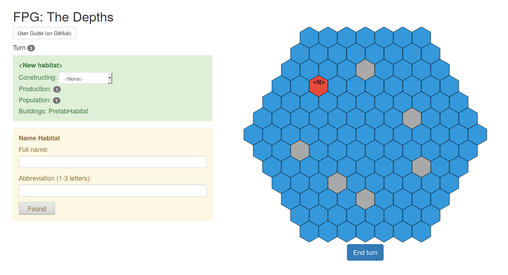

# The Depths

Casual, single-player strategy game written in Elm.



# User Guide

**Goal**: destroy all the opponent's habitats.

**Gameplay**: Combat only happens at habitats. Units not in combat are invisible to the opponent.

Combat happens in four stages:

1. Attackers with `sensors` try to detect defending combatants (fighting buildings and units).

2. Of those detected, attackers with `firepower` attempt to destroy them.

3. Defenders with `sensors` try to detect attacking units.

4. Of those detected, defenders with `firepower` attempt to destory them.

1 and 2 happen at the same time as 3 and 4, so a defender whose destroyed still gets to contribute its `sensors` and `firepower` before it's removed from the board.

`sensors` and `firepower` are chances out of 6, so a unit with `sensors` 2 and `firepower` 3 has a 1/3 change of detecting an opponent, and a 1/2 change of destroying a detected opponent. Units can destory opponents that were detected by other units. 

If there are no defending units or buildings with either `sensors` or `firepower`, then a "bombardment" occurs where the remaining buildings are automatically detected.

# Install

```sh
elm-make src/Main.elm --output=./site/main.js --warn --yes
firefox site/index.html
```

Or for live reload and debugging:

* install [elm-live](https://github.com/architectcodes/elm-live)
* run the dev script in the root directory:

```sh
./dev.sh`
```

* open `localhost:8000` in your browser

# Philosophy

One way to make games is to design for elegance. Elegant games have a few well though-out rules that give rise to complex strategies ([Agar.io](http://agar.io/) is a good example of this). This approach is especially well suited for challenging or competitive games.

The philosophy of _The Depths_ is the opposite.

Sometimes you just want a lot of cool options for stuff to build. That's what we'll try to provide.

# License

© Ian Jeffries 2018.

Everything original is released under the [3-Clause BSD License](https://opensource.org/licenses/BSD-3-Clause). It's also released under [CC0](https://creativecommons.org/share-your-work/public-domain/cc0/).

Please fork and modify at will!

# Special thanks

* To [@danneu](https://github.com/danneu/elm-hex-grid) for his [elm-hex-grid](https://github.com/danneu/elm-hex-grid) library. _The Depths_ started as a fork of that project's examples. Some of this game's hex board invoking code and CSS is still unchanged from there.

# Vendored

`./vendored/HexGrid.elm` and `./vendored/PairingHeap.elm` are from [my fork](https://github.com/seagreen/elm-hex-grid) of [elm-hex-grid](https://github.com/danneu/elm-hex-grid) commit # `3d834bc98ce4338c8ed6b4413d102abcb2eec75e`.
