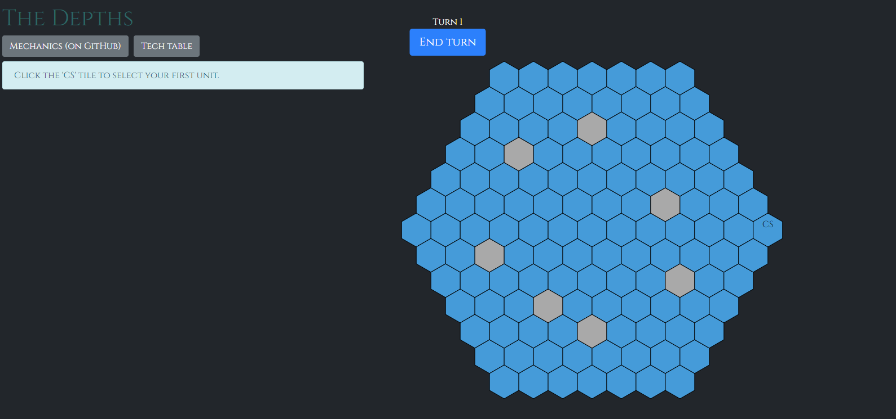

# The Depths

Casual, single-player strategy game written in Elm.

Play at [housejeffries.com/games/depths](https://housejeffries.com/games/depths).

FPG stands for Functional Propaganda Games.



# User Guide

**Goal**: establish four habitats or survive until turn 200.

**Disclaimer**: the game's a work-in-progress and (probably) not yet fun. Without enemy bases to attack there isn't much strategy, but I want to get the mechanics nailed down before I do anything else.

**Gameplay**: Combat only happens at habitats. Units not in combat are invisible to the opponent.

Note that to de-select a unit you have to click outside of its move range. If you click another unit within its move range you'll issue a new move command, not select the new unit. I'm considering switching to a more standard 'Left click selects' / 'Right click moves' setup to fix this.

To learn more you'll have to look at the source. I suggest:

* [src/Game/Unit.elm](./src/Game/Unit.elm)
* [src/Game/Building.elm](./src/Game/Building.elm)

If you want to try adding your own units, install `elm-make` (`elmPackages.elm` in Nixpkgs) and run:

```sh
elm-make src/Main.elm --output=./site/main.js --warn --yes
firefox site/index.html
```

Or for live reload and debugging:

* install [elm-live](https://github.com/architectcodes/elm-live)
* run the dev script in the root directory:

```sh
./dev.sh`
```

* open `localhost:8000` in your browser

# Philosophy

One way to make games is to design for elegance. Elegant games have a few well though-out rules that give rise to complex strategies ([Agar.io](http://agar.io/) is a good example of this). This approach is especially well suited for challenging or competitive games.

The philosophy of _The Depths_ is the opposite.

Sometimes you just want a lot of cool options for stuff to build. That's what we'll try to provide.

# License

© Ian Jeffries 2017.

_**Except for**_ the name of the organization, the name of the game, and any abbreviations of either, everything original is released under the [3-Clause BSD License](https://opensource.org/licenses/BSD-3-Clause).

A big reason this project exists is to push the state of games in Elm forward a bit. Please fork this and make your own game!

# Special thanks

* To [@danneu](https://github.com/danneu/elm-hex-grid) for his [elm-hex-grid](https://github.com/danneu/elm-hex-grid) library. _The Depths_ started as a fork of that project's examples. Some of this game's hex board invoking code and CSS is still unchanged from there.

# Vendored

`./vendored/HexGrid.elm` and `./vendored/PairingHeap.elm` are from [my fork](https://github.com/seagreen/elm-hex-grid) of [elm-hex-grid](https://github.com/danneu/elm-hex-grid) commit # `3d834bc98ce4338c8ed6b4413d102abcb2eec75e`.
